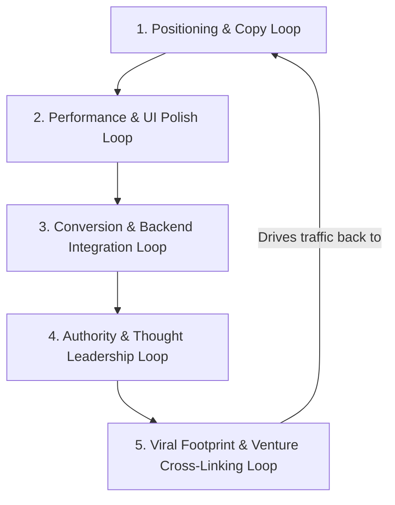

# OLADEVX — Founder OS Loops Playbook

This document defines the **Product, Development, and Growth Loops** designed to launch, refine, and scale your brand. Use these 5 loop phases as your execution roadmap.

---

## 🔁 Loop 1: The Positioning & Copy Loop
*Focus: Lock in your branding and make sure you read like an elite founder/architect.*

1. **Self-Audit**:
   - Verify that all files have zero references to "freelancer", "web designer", or "agency".
   - Confirm that the **Founder OS** section is prominently displayed right after the biosnapshot to set the tone immediately.
2. **Founder OS Verification**:
   - Ensure the checkmarks (✓) match your active products and planned entries (□) show future vision.
3. **Social Verification Loop**:
   - Deploy to a temporary preview link (e.g., Vercel or Netlify staging).
   - Send the link to 3 trusted founder friends. Ask them: *"When you land on this page, what is my job title?"* If they say "web developer" instead of "tech founder/product architect", refine the hero subheadline copy.

---

## 🔁 Loop 2: The Performance & UI Polish Loop
*Focus: Unmatched mobile responsiveness, frame rates, and visual smoothness.*

1. **Responsive Testing**:
   - Test scroll behavior on actual mobile devices. Ensure elements slide up nicely without causing horizontal scrollbars.
2. **Animation Frame Rates**:
   - Verify that the canvas particle grid floats smoothly at 60fps.
   - Check desktop cursor trails. If there's any lag on slower monitors, tweak the animation latency in `js/app.js`.
3. **Lighthouse Audit**:
   - Target a score of `95+` across Performance, Accessibility, and SEO.
   - Preload custom Google Fonts in `<head>` to avoid font-flashing.

---

## 🔁 Loop 3: The Conversion & Backend Integration Loop
*Focus: Turning website traffic into high-ticket clients automatically.*

1. **Form Destination**:
   - Connect the contact form in `index.html` to a serverless form tool (e.g., [Formspree](https://formspree.io/), [Netlify Forms](https://www.netlify.com/products/forms/), or your own Supabase endpoint).
2. **Automated Responder Loop**:
   - Set up an automated auto-responder email. When a client submits a project query, they should receive an instant response:
     > *"Hi, I received your project brief. To help me understand your operational requirements faster, schedule a direct 15-minute sync on my calendar here: [Your Calendly Link]."*
3. **Lead Routing**:
   - Route forms directly to your Telegram or Discord via webhooks so you get instant phone notifications.

---

## 🔁 Loop 4: The Authority & Thought Leadership Loop
*Focus: Providing proof that you are a business automation expert.*

1. **Connect the Blog Grid**:
   - Replace the blog placeholders in the "Thought Leadership" section with actual links to articles you post on Medium, Substack, or LinkedIn.
2. **Case Study Expansion**:
   - Turn the case studies (Scalewealth and SchoolOS) into detailed slide decks or PDFs that clients can download directly from the accordions.
3. **The 30-Day content Loop**:
   - Every time you ship a new feature on SchoolOS or Scalewealth, write a short post detailing the *architectural choice* you made. Link this post back to your portfolio.

---

## 🔁 Loop 5: The Viral Footprint & Venture Cross-Linking Loop
*Focus: Setting up organic traffic loops that pull clients back to OLADEVX.*

1. **Footer Branding**:
   - On every app you launch (Scalewealth, SchoolOS, future fintech solutions), insert a small, premium logo credit in the footer or settings:
     `Built by OLADEVX` or `Systems Engineered by OLADEVX`.
   - Link this directly to `oladevx.com`.
2. **The Inbound Funnel**:
   - Users of your ventures click the footer credit -> Land on OLADEVX -> See your Founder OS -> Realize you build custom systems -> Contact you to build their SaaS.
   - This creates a closed loop where your products sell your engineering capabilities!
